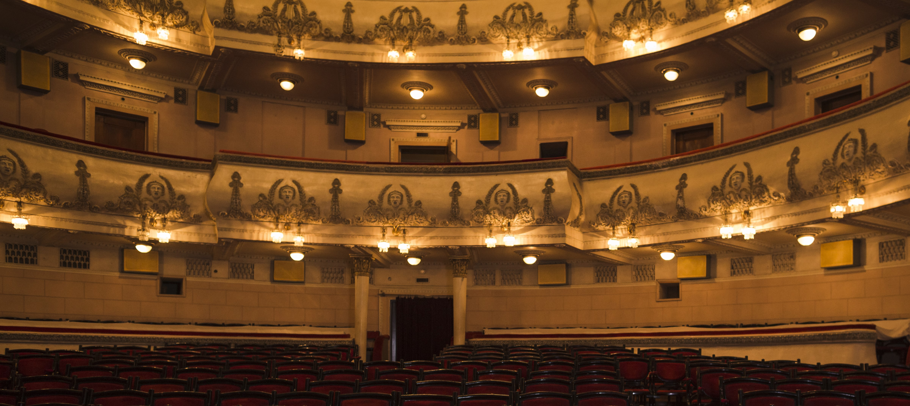
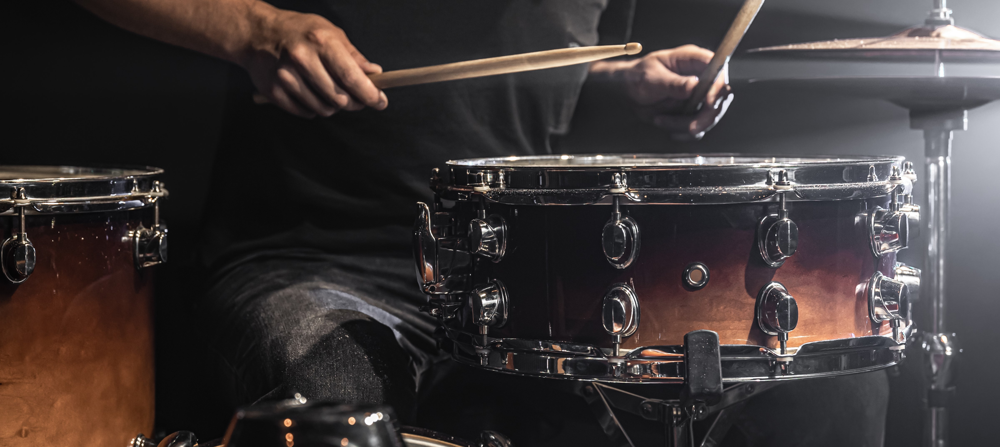

<html>
<head>

<title>6 girls on a stage</title>
<meta name="viewport" content="width=device-width, initial-scale=1">

</head>
<body>

  <a class="active" href="#home">Home</a>
  <a href="https://bella2402.github.io/Theatres-in-the-UK-and-Classical-Music/">Theatre</a>
  <a href="https://giuliam2.github.io/Exploring-the-rock-music-genre">Rock Music</a>
  <a href="https://bella2402.github.io/The-History-of-the-Guitar/">Guitars</a>
  <a href="https://giuliam2.github.io/Reports/">Our Reports</a>

<meta name="viewport" content="width=device-width, initial-scale=1">

<meta name="viewport" content="width=device-width, initial-scale=1">
<link rel="stylesheet" href="https://www.w3schools.com/w3css/4/w3.css">

<body>

  
  
<h1 align="left">Six girls  on a stage</h1>

   
  <h1 align="center">A journey into the discovery of music</h1>
 
  
Lorem ipsum <b>dolor</b> sit amet, consectetur adipisici elit, sed eiusmod <i>tempor</i> incidunt ut labore et dolore magna aliqua. Ut enim ad minim veniam, quis nostrud exercitation ullamco laboris nisi ut aliquid ex ea commodi consequat. Quis aute iure reprehenderit in voluptate velit esse cillum dolore eu fugiat nulla pariatur. Excepteur sint obcaecat cupiditat non proident, sunt in culpa qui officia deserunt mollit anim id est laborum.

   

  <a href="https://bella2402.github.io/Theatres-in-the-UK-and-Classical-Music/">
  
<h2 align="center">Theatres and classical music</h2>

  

  <a href="https://giuliam2.github.io/Exploring-the-rock-music-genre/">
  
<h2 align="center">Rock Music</h2>

 

  <a href="https://bella2402.github.io/The-History-of-the-Guitar/" alt="Guitar" style="width:100%;">
  
<h2 align="center">History of the guitar</h2>

 

<footer>
  
All rights reseved to the 6girls's project.

</footer>

</body>
</html> 

